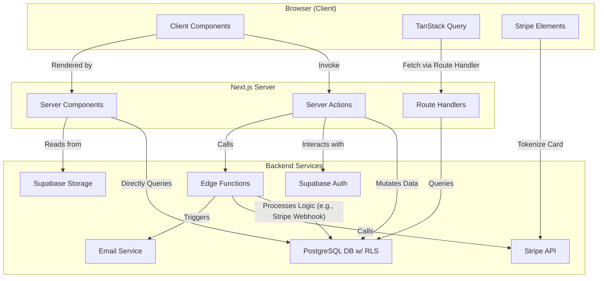

# Astewai - Design Document

## 1. Overview

Astewai is a modern full-stack digital bookstore built with Next.js 14, TypeScript, and Supabase. The platform follows a clean architecture pattern with a clear separation of concerns. The design emphasizes performance, scalability, and user experience by leveraging Server Components, Server Actions, optimistic updates, and a responsive, component-based UI.

## 2. Architecture

### 2.1. Technology Stack

**Frontend:**
- **Framework:** Next.js 14 (App Router)
- **Language:** TypeScript
- **Styling:** Tailwind CSS
- **UI Components:** Shadcn/ui
- **Data Fetching & State:** TanStack Query (React Query)

**Backend & Services:**
- **Platform:** Supabase (Auth, PostgreSQL, Storage, Edge Functions)
- **Database:** PostgreSQL with Row Level Security (RLS)
- **Payments:** Stripe
- **Email:** Resend (or Supabase built-in)
- **Package Management:** pnpm
- **Testing:** Jest, React Testing Library, Playwright

### 2.2. System Architecture

The architecture leverages the Next.js App Router, distinguishing between Server Components (for direct, secure data access) and Client Components (for interactivity). Server Actions are used for mutations, reducing the need for traditional API route handlers.



## 3. Core Components & Interfaces

### 3.1. Core Components

- **Authentication:** `AuthProvider`, `LoginForm`, `RegisterForm`, `ProtectedRoute`, `RoleGuard`
- **Book:** `BookGrid`, `BookCard`, `BookDetail`, `BookReader`, `SearchBar`
- **Bundle:** `BundleGrid`, `BundleCard`, `BundleDetail`
- **Library:** `LibraryTabs`, `LibraryGrid`, `ProgressBar`, `BookStatus`
- **Blog:** `BlogList`, `BlogCard`, `BlogPost`, `BlogFilter`
- **Admin:** `AdminDashboard`, `BookUpload`, `BundleManager`, `UserManager`, `PaymentRequests`

### 3.2. Data Interfaces

```typescript
// User & Profile
interface User {
  id: string;
  email: string;
  profile: UserProfile;
  role: 'user' | 'admin';
  created_at: string;
}

interface UserProfile {
  id: string; // Foreign key to auth.users.id
  user_id: string;
  display_name: string;
  avatar_url?: string;
  reading_preferences: {
    theme?: 'light' | 'dark' | 'sepia';
    font_size?: number;
  };
}

// Content
interface Book {
  id: string;
  title: string;
  author: string;
  description: string;
  cover_image_url: string;
  content_url: string; // URL to the book file (e.g., EPUB)
  price: number;
  is_free: boolean;
  category: string;
  tags: string[];
  created_at: string;
  updated_at: string;
}

interface Bundle {
  id: string;
  title: string;
  description: string;
  price: number;
  books: Book[]; // Populated via join
  created_at: string;
  updated_at: string;
}

interface BlogPost {
  id: string;
  title: string;
  slug: string; // For clean URLs
  content: string;
  excerpt: string;
  author_id: string;
  category: string;
  tags: string[];
  published: boolean;
  created_at: string;
  updated_at: string;
}

// User-Specific Data
interface UserLibraryItem {
  id: string;
  user_id: string;
  book_id: string;
  status: 'owned' | 'pending' | 'completed';
  progress: number; // Percentage
  last_read_position: string; // e.g., CFI for EPUB
  added_at: string;
}

interface Purchase {
  id: string;
  user_id: string;
  item_type: 'book' | 'bundle';
  item_id: string;
  amount: number;
  status: 'pending' | 'approved' | 'rejected' | 'completed'; // `completed` for Stripe, `pending` for manual
  payment_provider_id?: string; // Stripe Charge ID
  created_at: string;
  updated_at: string;
}
```

## 4. Data Models & Database

### 4.1. Helper Function: `updated_at` Trigger

This function will automatically update the `updated_at` column for any table it's applied to.

```sql
CREATE OR REPLACE FUNCTION public.handle_updated_at()
RETURNS TRIGGER AS $$
BEGIN
    NEW.updated_at = NOW();
    RETURN NEW;
END;
$$ LANGUAGE plpgsql;
```

### 4.2. Database Schema

**Profiles Table:**
```sql
CREATE TABLE profiles (
    id UUID REFERENCES auth.users ON DELETE CASCADE PRIMARY KEY,
    display_name TEXT,
    avatar_url TEXT,
    role TEXT DEFAULT 'user' NOT NULL CHECK (role IN ('user', 'admin')),
    reading_preferences JSONB DEFAULT '{}',
    created_at TIMESTAMPTZ DEFAULT NOW(),
    updated_at TIMESTAMPTZ DEFAULT NOW()
);

-- Trigger to auto-update the updated_at column
CREATE TRIGGER on_profiles_updated
    BEFORE UPDATE ON profiles
    FOR EACH ROW EXECUTE PROCEDURE public.handle_updated_at();
```

**Books Table:**
```sql
CREATE TABLE books (
    id UUID DEFAULT gen_random_uuid() PRIMARY KEY,
    title TEXT NOT NULL,
    author TEXT NOT NULL,
    description TEXT,
    cover_image_url TEXT,
    content_url TEXT,
    price DECIMAL(10,2) DEFAULT 0 NOT NULL,
    is_free BOOLEAN GENERATED ALWAYS AS (price = 0) STORED,
    category TEXT,
    tags TEXT[],
    created_at TIMESTAMPTZ DEFAULT NOW(),
    updated_at TIMESTAMPTZ DEFAULT NOW()
);

CREATE TRIGGER on_books_updated
    BEFORE UPDATE ON books
    FOR EACH ROW EXECUTE PROCEDURE public.handle_updated_at();
```

**Bundles & Bundle_Books Tables:**
```sql
CREATE TABLE bundles (
    id UUID DEFAULT gen_random_uuid() PRIMARY KEY,
    title TEXT NOT NULL,
    description TEXT,
    price DECIMAL(10,2) NOT NULL,
    created_at TIMESTAMPTZ DEFAULT NOW(),
    updated_at TIMESTAMPTZ DEFAULT NOW()
);

CREATE TRIGGER on_bundles_updated
    BEFORE UPDATE ON bundles
    FOR EACH ROW EXECUTE PROCEDURE public.handle_updated_at();

CREATE TABLE bundle_books (
    bundle_id UUID REFERENCES bundles(id) ON DELETE CASCADE,
    book_id UUID REFERENCES books(id) ON DELETE CASCADE,
    PRIMARY KEY (bundle_id, book_id)
);
```

**User_Library Table:**
```sql
CREATE TABLE user_library (
    id UUID DEFAULT gen_random_uuid() PRIMARY KEY,
    user_id UUID REFERENCES auth.users(id) ON DELETE CASCADE NOT NULL,
    book_id UUID REFERENCES books(id) ON DELETE CASCADE NOT NULL,
    status TEXT DEFAULT 'owned' NOT NULL CHECK (status IN ('owned', 'pending', 'completed')),
    progress INTEGER DEFAULT 0 CHECK (progress >= 0 AND progress <= 100),
    last_read_position TEXT,
    added_at TIMESTAMPTZ DEFAULT NOW(),
    UNIQUE(user_id, book_id)
);
```

**Blog_Posts Table:**
```sql
CREATE TABLE blog_posts (
    id UUID DEFAULT gen_random_uuid() PRIMARY KEY,
    title TEXT NOT NULL,
    slug TEXT NOT NULL UNIQUE,
    content TEXT NOT NULL,
    excerpt TEXT,
    author_id UUID REFERENCES auth.users(id),
    category TEXT,
    tags TEXT[],
    published BOOLEAN DEFAULT false,
    created_at TIMESTAMPTZ DEFAULT NOW(),
    updated_at TIMESTAMPTZ DEFAULT NOW()
);

CREATE TRIGGER on_blog_posts_updated
    BEFORE UPDATE ON blog_posts
    FOR EACH ROW EXECUTE PROCEDURE public.handle_updated_at();
```

**Purchases Table:**
```sql
CREATE TABLE purchases (
    id UUID DEFAULT gen_random_uuid() PRIMARY KEY,
    user_id UUID REFERENCES auth.users(id) ON DELETE CASCADE NOT NULL,
    item_type TEXT NOT NULL CHECK (item_type IN ('book', 'bundle')),
    item_id UUID NOT NULL,
    amount DECIMAL(10,2) NOT NULL,
    status TEXT DEFAULT 'pending' NOT NULL CHECK (status IN ('pending', 'approved', 'rejected', 'completed')),
    payment_provider_id TEXT, -- Stripe charge/payment intent ID
    created_at TIMESTAMPTZ DEFAULT NOW(),
    updated_at TIMESTAMPTZ DEFAULT NOW()
);

CREATE TRIGGER on_purchases_updated
    BEFORE UPDATE ON purchases
    FOR EACH ROW EXECUTE PROCEDURE public.handle_updated_at();
```

### 4.3. Row Level Security (RLS) Policies

RLS will be enabled on all tables containing user-specific or sensitive data.

**Profiles:**
- Users can view their own profile.
- Users can update their own profile.
- Admins can view and manage all profiles.

```sql
-- Allow users to read their own profile
CREATE POLICY "Allow individual read access" ON profiles FOR SELECT
USING (auth.uid() = id);

-- Allow users to update their own profile
CREATE POLICY "Allow individual update access" ON profiles FOR UPDATE
USING (auth.uid() = id);
```

**User Library:**
- Users can only read/write their own library items.

```sql
-- Allow full access to own library items
CREATE POLICY "Allow full access to own library" ON user_library
USING (auth.uid() = user_id) WITH CHECK (auth.uid() = user_id);
```

**Purchases:**
- Users can view their own purchase history.
- Admins can view all purchase history for support and reconciliation.

```sql
-- Allow users to read their own purchases
CREATE POLICY "Allow individual read access" ON purchases FOR SELECT
USING (auth.uid() = user_id);
```

**Public Data:**
- `books`, `bundles`, and published `blog_posts` will have permissive read policies for all users (including anonymous visitors).

```sql
-- Allow public read access for books
CREATE POLICY "Allow public read access" ON books FOR SELECT
USING (true);
```

## 5. Error Handling & Testing

### 5.1. Error Handling

- **Client-Side:** Utilize Next.js `error.tsx` files and React Error Boundaries. Forms will use libraries like `zod` for real-time validation. TanStack Query's error states will be used to show retry UI.
- **Server-Side:** Server Actions will return a discriminated union like `{ data, error }` to be handled gracefully by the client. Edge Functions and Route Handlers will use standard HTTP status codes (400, 401, 403, 500).

### 5.2. Testing Strategy

- **Unit Testing (Jest):** For utility functions, custom hooks, and Server Action logic.
- **Component Testing (React Testing Library):** For individual UI components in isolation, verifying rendering and user interactions.
- **Integration Testing:** Test interactions between components and mock API/database layers. Test RLS policies using Supabase's test utilities.
- **End-to-End Testing (Playwright):** Simulate full user journeys like registration, purchase, and reading a book.
- **Performance Testing (Lighthouse):** Automate Lighthouse runs in CI to monitor Core Web Vitals and performance budgets.
- **Accessibility Testing (axe-core):** Integrate accessibility checks into E2E tests and CI pipeline to enforce WCAG standards.